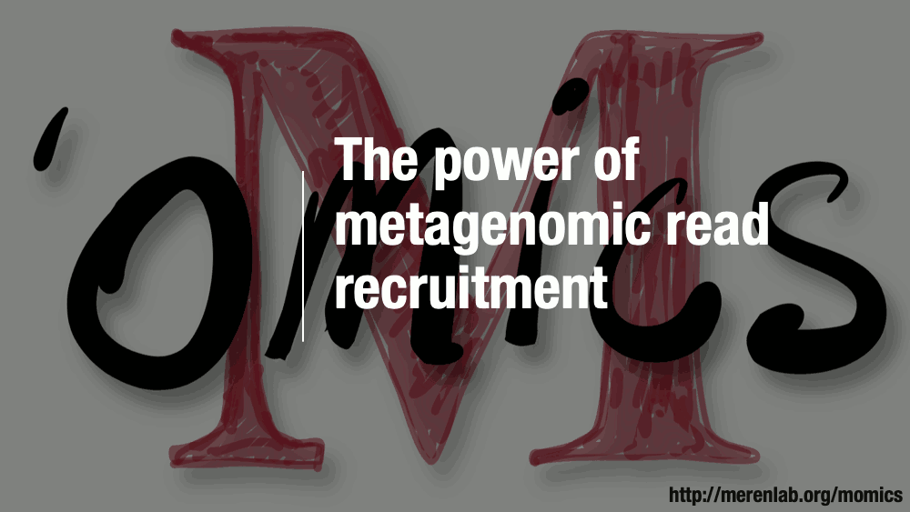
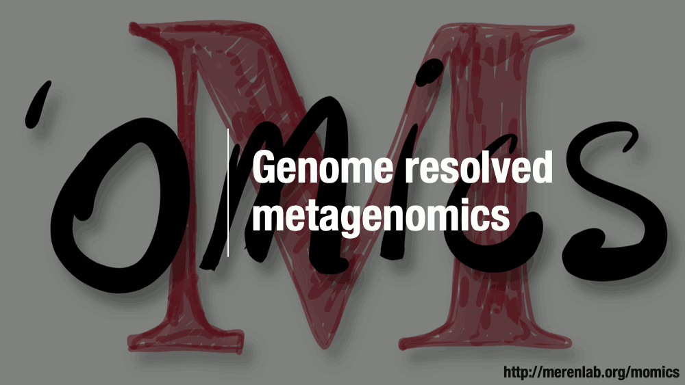
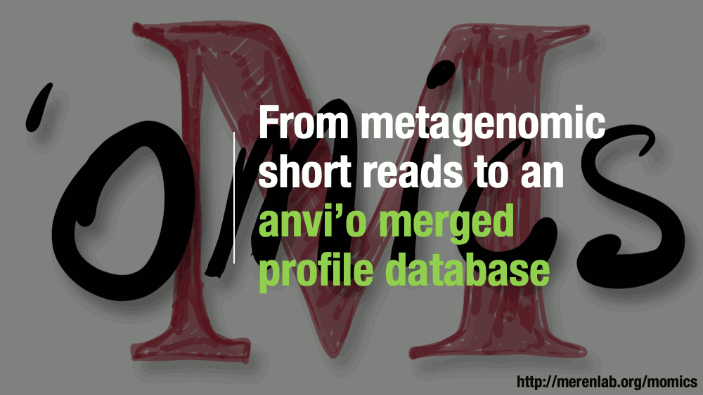



On this page you will find some of the reusable material [Meren Lab](http://merenlab.org) has developed to communicate key concepts in microbial 'omics. Please note that this is an evolving resource, and do not hesitate to get in touch with us if you have any questions or suggestions.



## Motivation

During the Spring semester of 2019, I started a new undergraduate course at the University of Chicago on microbial 'omics with the following description (the rest of the syllabus is [here](https://www.dropbox.com/s/vb1xqrec55kjnt0/microbial_omics.pdf)):

<i>Every ecological niche our planet has to offer, including the human body itself, is home to an astonishing number of microbial cells that form complex communities. The last several years witnessed tremendous advances in molecular and computational approaches which now offer unprecedented access to these communities through new 'omics strategies. Developing an overall understanding of these strategies -including the ability to identify their appropriate applications and shortcomings- has quietly become a de facto necessity in the journey of an independent life scientist. The primary aim of this course is to empower its participants and enable them to study the ecology, evolution, and functioning of naturally occurring microbial populations. Through equal proportions of theory and practice, the participants will use state-of-the-art computational methods to work with real-world microbial data and recognize the current conceptual framework that helps us wrap our collective mind around the most diverse form of life on our planet.</i>

Offering a deep appreciation of the fundamental concepts in microbial 'omics during the undergraduate journey of future life scientists is critical for two reasons. One, most microbial 'omics strategies are connected to one another, and two, classical undergraduate training in life sciences does not include adequate exposure to the basic principles behind commonly used computational strategies of data-enabled microbiology.

For a detailed communication of concepts in microbial 'omics, I started creating animations on my tablet computer and used them during the course. Advancing through these animations slide-by-slide created enough room for questions and discussions to elucidate ecological and evolutionary interpretations of primary forms of data. **My motivation to make these animations publicly available was to ensure that they are accessible to others who may be interested in using them to teach these concepts in a similar fashion** (PowerPoint slides for each animation is also available underneath every animation).

I am aware that while the raw form of these animations may be helpful for experts to teach others, they are not quite useful for students to learn these concepts by themselves without expert guidance. I am hoping to create narrated versions of these animations in the future to explain the meaning and significance of each step.

Resources on this page represent a fraction of the material we have developed for this course. We are hoping to advance its contents over time. Please feel free to share your invaluable suggestions.

<blockquote class="twitter-tweet">
Some of the material we have developed to teach Microbial &#39;Omics at the University of Chicago is now public:    <a href="https://t.co/3xEaeRgAXs">https://t.co/3xEaeRgAXs</a>  It is indeed a start rather than a final product, and I hope it will evolve with your feedback to become a useful community resource.
&mdash; A. Murat Eren (Meren) (@merenbey) <a href="https://twitter.com/merenbey/status/1156954062593638400?ref_src=twsrc%5Etfw">August 1, 2019</a></blockquote> 

## Concepts

The following sections describe each concept with a short summary of how I used them during the course. Please feel free to use any of the PowerPoint files in your own presentations, or let me know if you would like to chat about their interpretations.

### Metagenomic read recruitment

Metagenomic [read recruitment](../vocabulary/#read-recruitment) is one of the most commonly used strategies in microbial 'omics. The animation aims to support a discussion on non-specific read recruitment, [coverage](../vocabulary/#coverage) versus [detection](../vocabulary/#detection), and the association between read recruitment statistics and population genetics.

{:.warning}
Download PowerPoint slides for this animation from [here](01-metagenomic-read-recruitment.pptx).

### Genome-resolved metagenomics

We use the term 'genome-resolved metagenomics' to desribe a family of strategies that generate genome-level insights from metagenomes, rather than focusing solely on short reads for broad taxonomic or functional summaries of samples. The purpose of the animation is to support a discussion about the advantages and disadvantages of using reference genomes or metagenome-assembled genomes to recruit reads from metagenomes. It also provides an opportunity to discuss limitations of assembly and binning.

{:.warning}
Download PowerPoint slides for this animation from [here](02-genome-resolved-metagenomics.pptx).

### Reconstructing genomes from metagenomes

The aim of this animation is to discuss the general steps of reconstructing genomes from metagenomes. It shows that it is often not perfect, even when abundances of individual populations are relatively even. Often, population sizes dramatically differ between different taxa, which makes it quite difficult to reconstruct genomes of rare taxa.

{:.warning}
Download PowerPoint slides for this animation from [here](03-reconstructing-genomes-from-metagenomes.pptx).

#### Computing k-mer frquencies

We often use the fact that tetranucleotide frequencies of nucleotides are relatively conserved throughout genomes to identify [contig](../vocabulary/#contig)s that belong to the same [population](../vocabulary/#population) genome, however, what it even means to compute k-mer frequencies is not something covered in great detail. The purpose of this animation is to demonstrate how it is done step-by-step, and how this information could lead to the identification of sequences that are compositionally similar without any a priori knowledge about their origins.

{:.warning}
Download PowerPoint slides for this animation from [here](04-computing-kmer-frequencies.pptx).

#### Differential coverage

The assumption that [contigs](../vocabulary/#contig) belonging to the same population genome will have similar coverages within a given metagenome enables the use of differential coverage to reconstruct genomes. The purpose of this animation to discuss this principle step-by-step.

{:.warning}
Download PowerPoint slides for this animation from [here](05-computing-differential-coverage.pptx).

#### From metagenomic reads to anvi'o merged profiles

This animation demonstrates the essential steps of going from short reads to metagenomes in anvi'o.

{:.warning}
Download PowerPoint slides for this animation from [here](06-anvio-merged-profile-db.pptx).

### Pangenomics

Pangenomes are critical tools to understand how a given set of genomes relate to one another with respect to their entire gene content. The purpose of this animation is to describe common steps most computational strategies rely on to compute pangenomes.

{:.warning}
Download PowerPoint slides for this animation from [here](07-concept-of-pangenomics.pptx).

### Metapangenomics

We define a ‘metapangenome’ as the outcome of the analysis of pangenomes in conjunction with the environment, where the abundance and prevalence of gene clusters and genomes are recovered through shotgun metagenomes. The purpose of the following animation is to build on the previous description of pangenomics and show how it can integrate with environmental metagenomes.

{:.warning}
Download PowerPoint slides for this animation from [here](08-concept-of-metapangenomics.pptx).

### Phylogenomics

{:.notice}
Slides for this section will be available later.

### Phylogenetics vs Phylogenomics vs Pangenomics

A discussion on how these three commonly used strategies compare.

{:.warning}
Download PowerPoint slides for this animation from [here](09-approaches-for-comparative-genomics.pptx).

### Microbial Population Genetics

{:.notice}
Slides for this section will be available later.

### Metaepitranscriptomics

{:.notice}
Slides for this section will be available later.

## Exercises

### Metagenomic read recruitment

A small metagenomic read recruitment exercise (with a mysterious genome)

The following data pack contains a genome, and multiple metagenomes in relevant directories:

[https://www.dropbox.com/s/2hkjubrv11d0bh1/momics-week-02-data-analysis-assignment.tar.gz](https://www.dropbox.com/s/2hkjubrv11d0bh1/momics-week-02-data-analysis-assignment.tar.gz)

Please download it and unpack it, and make sure there is a **README.md** file in it. The contents of that file will be very similar to the rest of the information here, but what you will find on this page may be more up-to-date.

Your task is to use a metagenomic read recruitment strategy to characterize the contents of each metagenome in the context of this mysterious genome, and visualize the distribution of its genes across individuals to answer the following specific questions:

* What is this genome?
* Does every gene in this genome occur in every individual?
* If not, which genes are differentially distributed, and what are those genes?

You should feel free to describe what else you see. You should return a Markdown formatted file with every command line you have run so anyone can reproduce your analysis if they have these input data.

Here are some tips that may be useful for your analysis:

* Use Bowtie2 for read recruitment. Your purpose is to get some SAM files for each metagenome.
* Use samtools to generate BAM files to profile read recruitment results.
* Use anvi'o to generate a contigs database for your mysterious genome (using `anvi-gen-contigs-database` program), profile each BAM file (using `anvi-profile`), merge them (using `anvi-merge`), and visualize them (using `anvi-interactive`). Pro tip: there is a way to visualize the distribution patterns of each gene independently (it MAY BE in the help menu of anvi-interactive).

### Pangenomics

A small pangenomics exercise

This is a small exercise with pangenomics. At the link below you will find a data pack that contains 15 genomes:

[https://www.dropbox.com/s/1brw4c7h9i8ud2k/Bifidobacterium_genomes.tar.gz](https://www.dropbox.com/s/1brw4c7h9i8ud2k/Bifidobacterium_genomes.tar.gz)

Genomes in this data pack belong to the genus *Bifidobacterium*, however, you don't know which species are assigned to them. Please follow the [anvi'o pangenomics tutorial](http://merenlab.org/2016/11/08/pangenomics-v2/) to create a pangenome for all these 15 genomes using the program `anvi-pan-genome` with default parameters, and answer the following questions:

* How many single-copy core genes did you find?
* When you organize genomes based on gene cluster frequencies, how many main groups do you observe?
* Which species name would you annotate these genomes with?
* According to gene clusters, which two species of *Bifidobacterium* in this mixture are most closely related?
* What are the most enriched functions for each of the major clades in the final pangenome? (Pro tip: functional enrichment analysis is covered in the tutorial).
* Please include in your report a screenshot of your final display, and collect your cookie points if you have pretty displays :)

### Phylogenomics

A small phylogenomics exercise

Here you will use phylogenomics to investigate a metagenome-assembled genome of unknown origin. For this, you will use the following data pack, which contains all the genomes you need, already in anvi'o contigs database form:

[https://www.dropbox.com/s/h08c9ir2k7nw5fe/momics-week-06-data-analysis-assignment.tar.gz](https://www.dropbox.com/s/h08c9ir2k7nw5fe/momics-week-06-data-analysis-assignment.tar.gz)

Your purpose is to create a figure that is similar to this phylogenomic tree using anvi'o:

{:.width-90 .center}

The data pack contains a file called `UNKNOWN_CPR_GENOME.db`, which is an anvi'o contigs database for the unknown genome,  and a directory called `CPR_GENOMES_FROM_BROWN_et_al`, which contains 797 contigs databases for the CPR genomes released by [Brown et al](https://www.nature.com/articles/nature14486) in 2015. **Your task is to put our `UNKNOWN_CPR_GENOME` into the context of all these 797 genomes using phylogenomics.**

Here are some tips:

* You can use the program `anvi-get-sequences-for-hmm-hits` to get all the amino acid sequences of interest from an HMM collection (you can ask anvi'o to `--concatenate-genes` for you, and to `--return-best-hit` if there are multiple hits to single-copy core genes in a given genome). This will result in a FASTA file that is ready for a phylogenomic analysis. I suggest you to use the parameter `--hmm-source Campbell_et_al` for the HMM collection (since this collection includes bacterial single-copy core genes), but you will have to find out which gene names to focus on.

* You should first determine which genes you should use from Campbell_et_al with `anvi-get-sequences-for-hmm-hits`. If I were you, I would have used the Ribosomal proteins, and first investigated which ones are occurring in the UNKNOWN_CPR_GENOME. `anvi-script-gen-hmm-hits-matrix-across-genomes` is a great program for that.

* Once you have the list of Ribosomal proteins that are definitely in UNKNOWN_CPR_GENOME you will also want to select those genomes from the 797 that also have most of those genes for a proper phylogenomic analysis. For THAT, you can use the parameter `--max-num-genes-missing-from-bin` with `anvi-get-sequences-for-hmm-hits`. Read the help menu, and you will see how it is relevant.

* Once you have a proper FASTA file, you can use the program `anvi-gen-phylogenomic-tree` to compute the tree. Or you can use a better strategy (such as [IQ-TREE](http://www.iqtree.org/)) to compute a tree. It is up to you how to compute your tree, but you will have to root it. Rooting trees is not easy if you don't have an out group (my out group is shown as the most-left black genomes on my tree above). As an out group, I suggest you to download 1 to 5 genomes from the NCBI (say, those that belong to the phylum Firmicutes), turn them into contigs databases, and include them in your analysis.

* Once you have a proper tree file, you can visualize using anvi'o. Running the exact command line above for the first time will create the PROFILE.db for you automatically. You can then use [anvi'o misc data tables](http://merenlab.org/2017/12/11/additional-data-tables/) to import any kind of information (to create the colors based on phylum names of your genomes to adding anything you like into your display). Remember, if you right-click on any branch in your tree in anvi'o while pressing the command key (or control, if you are using Windows or Linux) you can re-root your trees, and store them permanently.

