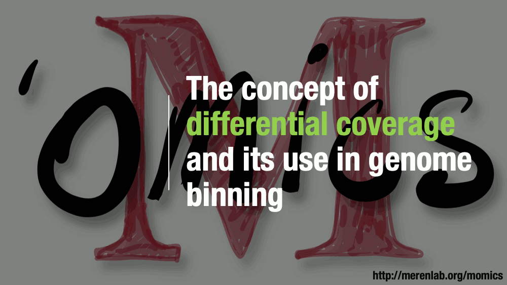
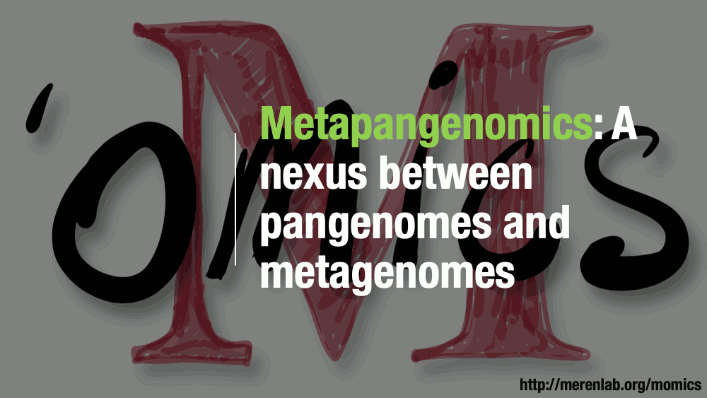



{:.notice}
The purpose of this page is to serve some of the reusable material [Meren Lab](http://merenlab.org) has developed to teach key concepts in microbial 'omics. Please note that this is an evolving resource and do not hesitate to get in touch with us if you have any questions or suggestions.



During the Spring semester of 2019 I started teaching at the University of Chicago an undergraduate class on microbial 'omics. For those of you who may be interested, this is the description of the course from its [syllabus](https://www.dropbox.com/s/37v8i3er6uju9ku/MOmics_Draft_Syllabus.pdf):

<i>Every ecological niche our planet has to offer, including the human body itself, is home to an astonishing number of microbial cells that form complex communities. The last several years witnessed tremendous advances in molecular and computational approaches which now offer unprecedented access to these communities through new 'omics strategies. Developing an overall understanding of these strategies -including the ability to identify their appropriate applications and shortcomings- has quietly become a de facto necessity in the journey of an independent life scientist. The primary aim of this course is to empower its participants and enable them to study the ecology, evolution, and functioning of naturally occurring microbial populations. Through equal proportions of theory and practice, the participants will use state-of-the-art computational methods to work with real-world microbial data and recognize the current conceptual framework that helps us wrap our collective mind around the most diverse form of life on our planet.</i>

I came to the realization during the course that teaching fundamental concepts is extremely critical since most microbial 'omics strategies are connected to one another. I started creating animations on my tablet computer to talk about some of the key concepts in great detail. Advancing through these animations slide-by-slide made sure that there is enough room for questions and discussions to elucidate ecological and evolutionary interpretations of primary forms of data. I decided to make them publicly available in case this resoruce may help others to teach these concepts effectively. You will also find PowerPoint files on this page to use them in your own presentations.

{:.notice}
Resources on this page unfortunately represents only a fraction of the material we have developed for this course. I also realize that while the raw form of these animations may be helpful for experts to teach others, they are not quite useful for students to learn these concepts by themselves. I am hoping to improve it piece by piece, and eventually add voice over these animations to explain the meaning and significance of each step. Meanwhile please feel free to reach out in case you have any questions or concerns.

## Metagenomic read recruitment

{:.warning}
Download PowerPoint slides for this animation from [here](01-metagenomic-read-recruitment.pptx).

## Genome-resolved metagenomics

{:.warning}
Download PowerPoint slides for this animation from [here](02-genome-resolved-metagenomics.pptx).

## Reconstructing genomes from metagenomes

{:.warning}
Download PowerPoint slides for this animation from [here](03-reconstructing-genomes-from-metagenomes.pptx).

### Computing k-mer frquencies

{:.warning}
Download PowerPoint slides for this animation from [here](04-computing-kmer-frequencies.pptx).

### Differential coverage

{:.warning}
Download PowerPoint slides for this animation from [here](05-computing-differential-coverage.pptx).

### From metagenomic reads to anvi'o merged profiles

{:.warning}
Download PowerPoint slides for this animation from [here](06-anvio-merged-profile-db.pptx).

## Pangenomics

{:.warning}
Download PowerPoint slides for this animation from [here](07-concept-of-pangenomics.pptx).

## Metapangenomics

{:.warning}
Download PowerPoint slides for this animation from [here](08-concept-of-metapangenomics.pptx).

## Phylogenetics vs Phylogenomics vs Pangenomics

{:.warning}
Download PowerPoint slides for this animation from [here](09-approaches-for-comparative-genomics.pptx).

