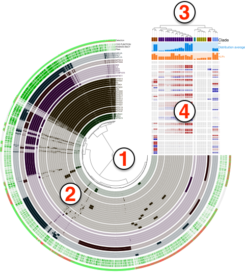



A DISPLAY-type anvi'o artifact. This artifact is typically generated, used, and/or exported **by anvi'o** (and not provided by the user)..

Back to the **[main page](../../)** of anvi'o programs and artifacts.

## Provided by

[anvi-display-contigs-stats](../../programs/anvi-display-contigs-stats) [anvi-display-functions](../../programs/anvi-display-functions) [anvi-display-metabolism](../../programs/anvi-display-metabolism) [anvi-display-pan](../../programs/anvi-display-pan) [anvi-display-structure](../../programs/anvi-display-structure) [anvi-inspect](../../programs/anvi-inspect) [anvi-interactive](../../programs/anvi-interactive) [anvi-script-gen-functions-per-group-stats-output](../../programs/anvi-script-gen-functions-per-group-stats-output) [anvi-script-snvs-to-interactive](../../programs/anvi-script-snvs-to-interactive)

## Required or used by

There are no anvi'o tools that use or require this artifact directly, which means it is most likely an end-product for the user.

## Description

This page describes general properties of anvi'o interactive displays and programs that offer anvi'o interactive artifacts.

## Terminology

Anvi'o uses a simple terminology to address various aspects of interactive displays it produces, such as items, layers, views, orders, and so on. The purpose of this section is to provide some insights into these terminology using the figure below:

{:.center-img}

Even though the figure is a product of [anvi-display-pan](/software/anvio/help/main/programs/anvi-display-pan), the general terminology does not change across different interfaces, including the default visualizations of [anvi-interactive](/software/anvio/help/main/programs/anvi-interactive). Here are the descriptions of numbered areas in the figure:

* The tree denoted by **(1)** shows the organization of each `item`. Items could be contigs, gene clusters, bins, genes, or anything else depending on which mode the anvi'o interactive interface was initiated. The structure that orders items and denoted by **(1)** in the figure can be a phylogenetic or phylogenomic tree, or a dendrogram produced by a hierarchical clustering algorithm. In addition, there may be nothing there, if the user has requested or set a linear items order through [misc-data-items-order](/software/anvio/help/main/artifacts/misc-data-items-order).
* Each concentric circle underneath the number **(2)** is called a `layer` and the data shown for items and layers as a whole is called a `view`. A **layer** can be a genome, a metagenome, or anything else depending on which mode the anvi'o interactive was initiated. The **view** is like a data table where a datum is set for each **item** in each **layer**. The view data is typically computed by anvi’o and stored in pan databases by [anvi-pan-genome](/software/anvio/help/main/programs/anvi-pan-genome) or profile databases by [anvi-profile](/software/anvio/help/main/programs/anvi-profile). The user add another view to the relevant combo box in the interface by providing a TAB-delimited file to [anvi-interactive](/software/anvio/help/main/programs/anvi-interactive) through the command line argument `--additional-view`, or add new layers to extend these vies with additional data through [misc-data-items](/software/anvio/help/main/artifacts/misc-data-items).
* The tree denoted by **(3)** shows a specific ordering of layers. Anvi'o will compute various layer orders automatically based on available **view** depending on the analysis or visualization mode, and users can extend available **layer orders** through [misc-data-layer-orders](/software/anvio/help/main/artifacts/misc-data-layer-orders).
* What is shown by **(4)** is the additional data for layers. the user can extend this section with additional information on layers using the [misc-data-layers](/software/anvio/help/main/artifacts/misc-data-layers).

The orchestrated use of [anvi-import-misc-data](/software/anvio/help/main/programs/anvi-import-misc-data), [anvi-export-misc-data](/software/anvio/help/main/programs/anvi-export-misc-data), and [anvi-delete-misc-data](/software/anvio/help/main/programs/anvi-delete-misc-data) provides a powerful framework to decorate items or layers in a display and enhance visualization of complex data. Please take a look at the following article on how to extend anvi'o displays:

* [https://merenlab.org/2017/12/11/additional-data-tables/](https://merenlab.org/2017/12/11/additional-data-tables/)

## Programs that give interactive access

If you're new to the anvi'o interactive interface, you'll probably want to check out [this tutorial for beginners](http://merenlab.org/tutorials/interactive-interface/) or the other resources on the  [anvi-interactive](/software/anvio/help/main/programs/anvi-interactive) page.

However, there are more interfaces available in anvi'o than just that one, so let's list them out:

- [anvi-display-structure](/software/anvio/help/main/programs/anvi-display-structure) lets you examine specific protein structures, along with SCV and SAAVs within it. (It even has [its own software page.](http://merenlab.org/software/anvio-structure/). It's kind of a big deal.)

- [anvi-display-contigs-stats](/software/anvio/help/main/programs/anvi-display-contigs-stats) shows you various stats about the contigs within a [contigs-db](/software/anvio/help/main/artifacts/contigs-db), such as their hmm-hits, lengths, N and L statistics, and so on.

- [anvi-display-functions](/software/anvio/help/main/programs/anvi-display-functions) lets you quickly browse the functional pool for a given set of genomes or metagenomes.

- [anvi-display-metabolism](/software/anvio/help/main/programs/anvi-display-metabolism) is still under development but will allow you to interactively view metabolism estimation data using [anvi-estimate-metabolism](/software/anvio/help/main/programs/anvi-estimate-metabolism) under the hood.

- [anvi-display-pan](/software/anvio/help/main/programs/anvi-display-pan) displays information about the gene clusters that are stored in a [pan-db](/software/anvio/help/main/artifacts/pan-db). It lets you easily view your core and accessory genes, and can even be turned into a metapangenome through importing additional data tables.

- [anvi-inspect](/software/anvio/help/main/programs/anvi-inspect) lets you look at a single split across your samples, as well as the genes identified within it. This interface can also be opened from the [anvi-interactive](/software/anvio/help/main/programs/anvi-interactive) interface by asking for details about a specific split.

- [anvi-interactive](/software/anvio/help/main/programs/anvi-interactive) displays the information in a [profile-db](/software/anvio/help/main/artifacts/profile-db). It lets you view the distribution of your contigs across your samples, manually bin metagenomic data into MAGSs (and refine those bins with [anvi-refine](/software/anvio/help/main/programs/anvi-refine)), and much more. You can also use this to look at your genes instead of your contigs or [examine the genomes after a phylogenomic anlysis](http://merenlab.org/2017/06/07/phylogenomics/). Just look at that program page for a glimpse of this program's amazingness.

- [anvi-script-snvs-to-interactive](/software/anvio/help/main/programs/anvi-script-snvs-to-interactive) lets you view a comprehensive summary of the SNVs, SCVs, and SAAVs within your contigs.

{:.notice}
Edit [this file](https://github.com/merenlab/anvio/tree/master/anvio/docs/artifacts/interactive.md) to update this information.

