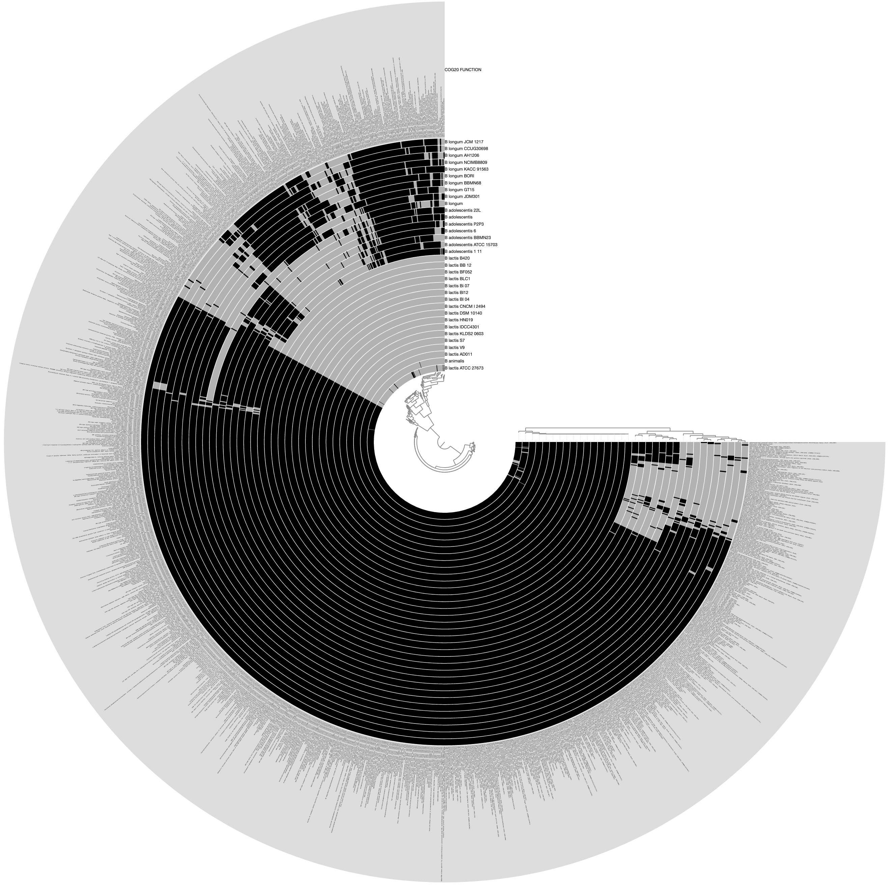
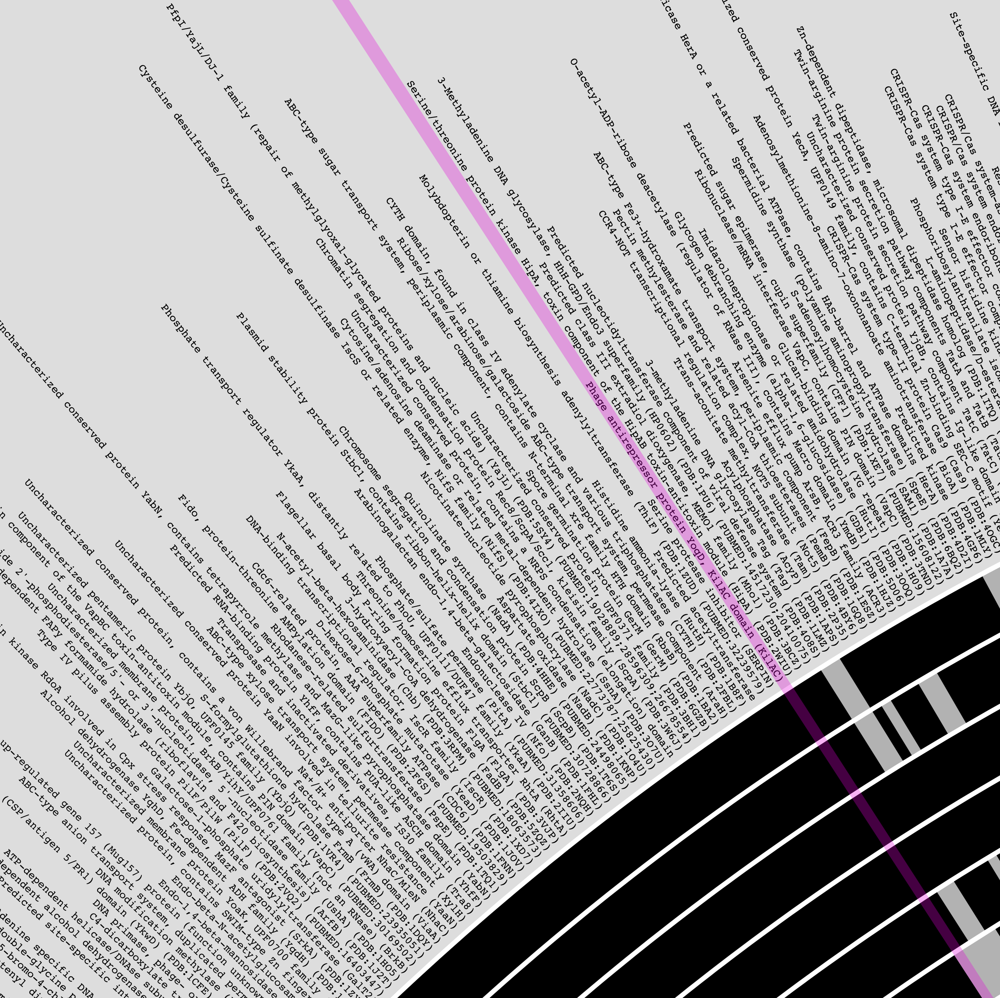
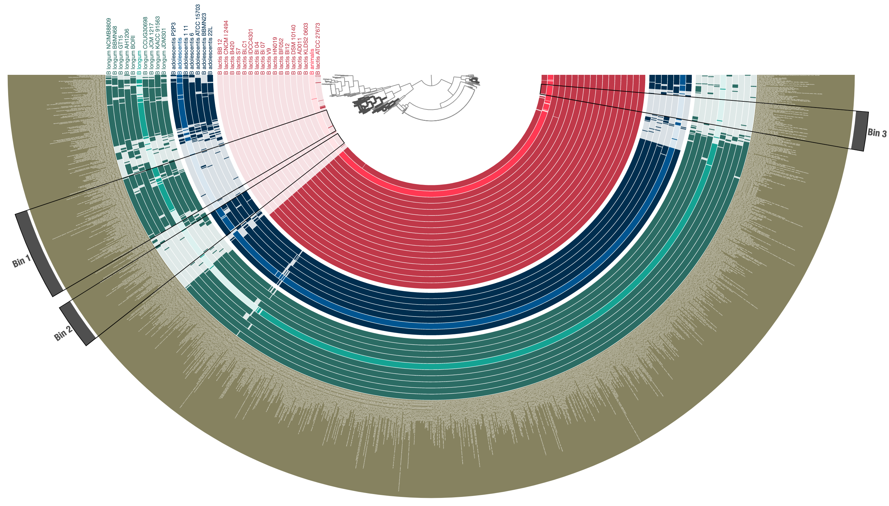

Start an anvi&#x27;o interactive display to see functions across genomes.

See **[program help menu](../../../../vignette#anvi-display-functions)** or go back to the **[main page](../../)** of anvi'o programs and artifacts.



{{ "network.json" }}
{{ 300 }}


## Can provide

[interactive](../../artifacts/interactive) 

## Can consume

[functions](../../artifacts/functions)  [genomes-storage-db](../../artifacts/genomes-storage-db)  [internal-genomes](../../artifacts/internal-genomes)  [external-genomes](../../artifacts/external-genomes) 

## Usage

For a given annotation source for [functions](/software/anvio/help/main/artifacts/functions), this program will display distribution patterns of unique function names (or accession numbers) across genomes stored in anvi'o databases.

It is a powerful way to analyze differentially occurring functions for any source of annotation that is shared across all genomes.

Currently, [anvi-display-functions](/software/anvio/help/main/programs/anvi-display-functions) can work with any combination of genomes from [external-genomes](/software/anvio/help/main/artifacts/external-genomes), [internal-genomes](/software/anvio/help/main/artifacts/internal-genomes), and [genomes-storage-db](/software/anvio/help/main/artifacts/genomes-storage-db).

### Basic Run 

The simplest way to run this program is as follows:

anvi&#45;display&#45;functions &#45;e [external&#45;genomes](/software/anvio/help/main/artifacts/external&#45;genomes) \
                       &#45;&#45;annotation&#45;source KOfam \
                       &#45;&#45;profile&#45;db KOFAM&#45;PROFILE.db

You can replace the annotation source based on what is available across your genomes. You can use the program [anvi-db-info](/software/anvio/help/main/programs/anvi-db-info) to see all available function annotation sources in a given [contigs-db](/software/anvio/help/main/artifacts/contigs-db) or [genomes-storage-db](/software/anvio/help/main/artifacts/genomes-storage-db). Please see [functions](/software/anvio/help/main/artifacts/functions) for more information on functions and how to obtain them.

{:.notice}
Please note that a [profile-db](/software/anvio/help/main/artifacts/profile-db) will be automatically generated for you. Once it is generated, the same profile database can be visualized over and over again using [anvi-interactive](/software/anvio/help/main/programs/anvi-interactive) in manual mode, without having to retain any other files.

### Aggregating functions using accession IDs

Once it is run, this program essentially aggregates all function names that occur in one or more genomes in the set of genomes found in input sources. The user can ask the program to use accession IDs to aggregate functions rather than function names:

anvi&#45;display&#45;functions &#45;e [external&#45;genomes](/software/anvio/help/main/artifacts/external&#45;genomes) \
                       &#45;&#45;annotation&#45;source KOfam \
                       &#45;&#45;profile&#45;db KOFAM&#45;PROFILE.db \
                       &#45;&#45;aggregate&#45;based&#45;on&#45;accession

While the default setting which is to use function names will be appropriate for most applications, using accession IDs instead of function names may be important for specific applications. There may be an actual difference between using functions or accession to aggregate data since multiple accession IDs in various databases may correspond to the same function. This may lead to misleading enrichment analyses downstream as identical function annotations may be over-split into multiple groups. Thus, the default aggregation method uses function names.

### Aggregating functions using accession IDs

In some cases a gene may be annotated with multiple functions. This is a decision often made at the function annotation tool level. For instance [anvi-run-ncbi-cogs](/software/anvio/help/main/programs/anvi-run-ncbi-cogs) may yield two COG annotations for a single gene because the significance score for both hits may exceed the default cutoff. While this can be useful in [anvi-summarize](/software/anvio/help/main/programs/anvi-summarize) output where things should be most comprehensive, having some genes annotated with multiple functions and others with one function may over-split them (since in this scenario a gene with COGXXX and COGXXX;COGYYY would end up in different bins). Thus, [anvi-display-functions](/software/anvio/help/main/programs/anvi-display-functions) will will use the best hit for any gene that has multiple hits. But this behavior can be turned off the following way:

anvi&#45;display&#45;functions &#45;e [external&#45;genomes](/software/anvio/help/main/artifacts/external&#45;genomes) \
                       &#45;&#45;annotation&#45;source KOfam \
                       &#45;&#45;profile&#45;db KOFAM&#45;PROFILE.db \
                       &#45;&#45;aggregate&#45;using&#45;all&#45;hits

---

The user also can keep only functions that occur in more than a minimum number of genomes:

anvi&#45;display&#45;functions &#45;e [external&#45;genomes](/software/anvio/help/main/artifacts/external&#45;genomes) \
                       &#45;&#45;annotation&#45;source KOfam \
                       &#45;&#45;profile&#45;db KOFAM&#45;PROFILE.db \
                       &#45;&#45;min&#45;occurrence 5

### Combining genomes from multiple sources

Alternatively, you can run the program by combining genomes from multiple sources:

anvi&#45;display&#45;functions &#45;e [external&#45;genomes](/software/anvio/help/main/artifacts/external&#45;genomes) \
                       &#45;i [internal&#45;genomes](/software/anvio/help/main/artifacts/internal&#45;genomes) \
                       &#45;g [genomes&#45;storage&#45;db](/software/anvio/help/main/artifacts/genomes&#45;storage&#45;db) \
                       &#45;&#45;annotation&#45;source KOfam \
                       &#45;&#45;profile&#45;db KOFAM&#45;PROFILE.db

### A real-world example

Assume we have a list of [external-genomes](/software/anvio/help/main/artifacts/external-genomes) that include three different species of *Bifidobacterium*. Running the following command,

anvi&#45;display&#45;functions &#45;&#45;external&#45;genomes Bifidobacterium.txt \
                       &#45;&#45;annotation&#45;source COG20_FUNCTION \
                       &#45;&#45;profile&#45;db COG20&#45;PROFILE.db \
                       &#45;&#45;min&#45;occurrence 3

Would produce the following display by default, where each layer is one of the genomes described in the [external-genomes](/software/anvio/help/main/artifacts/external-genomes) file, and each item is a unique function name that occur in `COG20_FUNCTION` (which was obtained by running [anvi-run-ncbi-cogs](/software/anvio/help/main/programs/anvi-run-ncbi-cogs) on each [contigs-db](/software/anvio/help/main/artifacts/contigs-db) in the external genomes file) that were found in more than three genomes:

[{:.center-img .width-50}](../../images/anvi-display-functions-01.png)

The outermost layer shows the function names:

[{:.center-img .width-50}](../../images/anvi-display-functions-02.png)

After a quick prettification through the [interactive](/software/anvio/help/main/artifacts/interactive) interface, leads to a cleaner display of three distinct species in this group, and functions that are uniquely enriched in either of them: 

[{:.center-img .width-80}](../../images/anvi-display-functions-03.png)

Now the resulting [profile-db](/software/anvio/help/main/artifacts/profile-db) can be used by [anvi-interactive](/software/anvio/help/main/programs/anvi-interactive) to re-visualize these data, or can be shared with the community without sharing the underlying contigs databases.

{:.notice}
Edit [this file](https://github.com/merenlab/anvio/tree/master/anvio/docs/programs/anvi-display-functions.md) to update this information.

## Additional Resources

{:.notice}
Are you aware of resources that may help users better understand the utility of this program? Please feel free to edit [this file](https://github.com/merenlab/anvio/tree/master/bin/anvi-display-functions) on GitHub. If you are not sure how to do that, find the `__resources__` tag in [this file](https://github.com/merenlab/anvio/blob/master/bin/anvi-interactive) to see an example.
